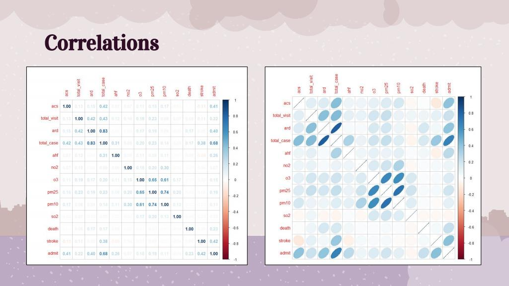
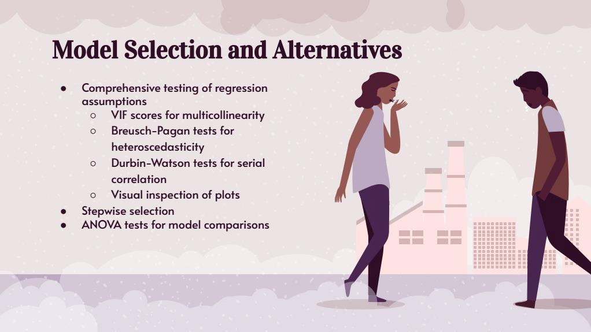
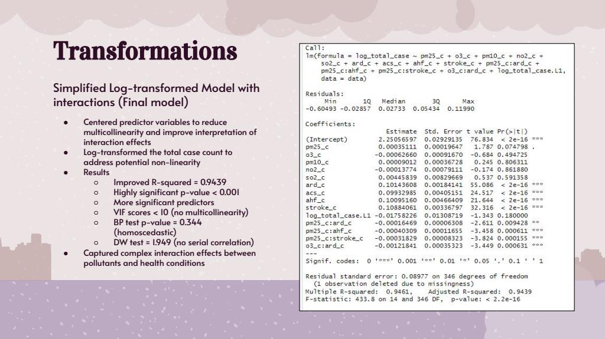
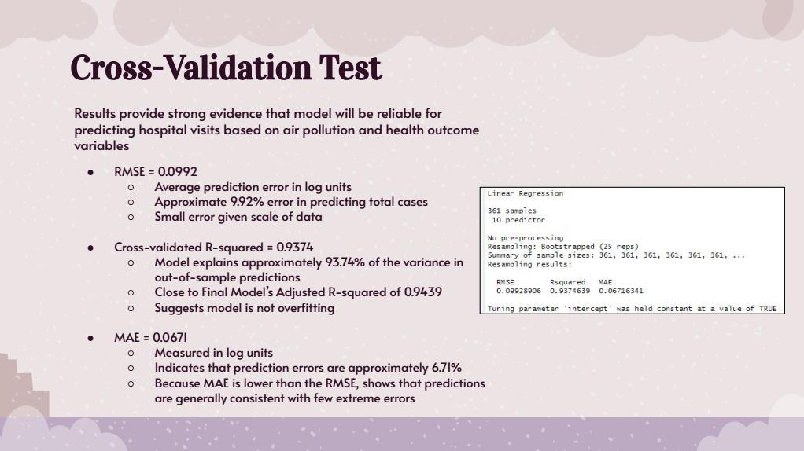
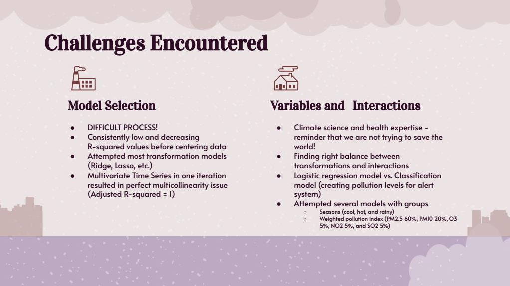

# Air Pollution and Hospital Demand Analytics

An academic predictive analytics project examining relationships between air quality indicators, health outcomes, and hospital case volumes using R, statistical modeling, and model validation techniques.

---

## Project Overview

Air pollution is a growing public health concern with significant implications for healthcare demand and hospital operations. This project investigates how environmental factors such as PM2.5, PM10, ozone (O₃), nitrogen dioxide (NO₂), and sulfur dioxide (SO₂) relate to hospital case volumes and selected health outcomes.

Using daily environmental and healthcare data collected from Maharaj Nakorn Chiang Mai Hospital in Thailand, this analysis explores whether predictive analytics can support proactive healthcare planning and resource preparedness during periods of poor air quality. 

**Course:** ITEC 621 – Predictive Analytics  
**Authors:** Nisso Hamralizoda & Kelly Compton

---

## Business Question

> How can healthcare organizations use predictive analytics to better anticipate healthcare demand and improve operational preparedness during periods of poor air quality? 

---

## Dataset

The dataset contains daily observations collected between April 2018 and March 2019 and includes:

### Environmental Variables
- PM2.5
- PM10
- Ozone (O₃)
- Nitrogen Dioxide (NO₂)
- Sulfur Dioxide (SO₂)

### Health Variables
- Emergency Department Visits
- Hospital Admissions
- Acute Respiratory Disease (ARD)
- Acute Coronary Syndrome (ACS)
- Acute Heart Failure (AHF)
- Stroke Cases
- Deaths

---

## Analytical Approach

Several modeling approaches were evaluated throughout the project:

1. Exploratory Data Analysis (EDA)
2. Correlation Analysis
3. Ordinary Least Squares (OLS) Regression
4. Multivariate Time-Series Modeling
5. Stepwise Variable Selection
6. Log Transformation of Response Variables
7. Variable Centering
8. Interaction Effects Modeling
9. Model Diagnostics
10. Bootstrap Cross Validation
11. Polynomial Regression Evaluation
12. Spline Regression Evaluation

The final model combined a log-transformed response variable, centered predictors, and interaction effects, resulting in substantially improved predictive performance while maintaining acceptable diagnostic test results.

---

## Tools & Technologies

- R
- Predictive Analytics
- Linear Regression
- Time-Series Analysis
- Statistical Modeling
- Feature Engineering
- Data Visualization
- Cross Validation
- Hypothesis Testing
- Model Diagnostics

---

## Model Development Journey

Throughout the project, multiple alternative approaches were tested and compared, including lagged environmental variables, stepwise selection, interaction effects, polynomial regression, and spline models.

A key breakthrough occurred after centering predictor variables and introducing interaction terms, which substantially improved model performance and interpretability. The final interaction model was selected because it achieved the best balance of:

- Statistical performance
- Model simplicity
- Interpretability
- Validation results
- Diagnostic test performance

---

## Key Findings

- Air pollution variables demonstrated meaningful relationships with selected health outcomes.
- Interaction effects between pollutants and health conditions substantially improved explanatory power.
- The final interaction model achieved an Adjusted R² of approximately **0.94**.
- Bootstrap validation demonstrated strong predictive stability with low prediction error.
- Alternative nonlinear approaches, including polynomial and spline models, did not significantly outperform the selected final model. 

---

## Visualizations

### Correlation Matrix



Exploratory analysis of relationships among environmental and health variables.

### Model Selection Process



Alternative modeling approaches, diagnostic testing, and model-selection decisions.

### Final Model Diagnostics



Final interaction model with centered predictors, diagnostic tests, and model performance statistics.

### Cross Validation Results



Bootstrap validation results showing predictive stability and generalization performance.

### Challenges Encountered



Overview of modeling challenges, alternative approaches evaluated, and lessons learned throughout the analytical process.

---

## Skills Demonstrated

### Data Analysis
- Data cleaning and preprocessing
- Missing value treatment
- Variable engineering
- Statistical interpretation

### Modeling
- Multiple Linear Regression
- Log Transformation
- Interaction Effects
- Lagged Variables
- Feature Engineering
- Model Selection
- Model Validation

### Diagnostics
- Variance Inflation Factor (VIF)
- Breusch-Pagan Testing
- Durbin-Watson Testing
- Residual Analysis

### Communication
- Translating analytical findings into business recommendations
- Presenting technical findings to non-technical audiences
- Data-driven decision support

---

## Challenges Encountered

This project involved extensive experimentation before arriving at the final model.

Key challenges included:

- Consistently low explanatory power in early models
- Multicollinearity issues in alternative specifications
- Evaluating multiple transformations and interaction structures
- Balancing model complexity with interpretability
- Addressing non-linear relationships within the dataset

These challenges ultimately reinforced the importance of feature engineering, data transformation, and careful model selection. 

---

## Project Limitations

This project should be viewed as an academic predictive analytics case study rather than a production healthcare forecasting system.

The final model predicts total case volume using both environmental variables and condition-specific health outcomes. Future work could incorporate broader hospital utilization metrics, additional environmental indicators, and external validation using multiple healthcare systems. 

---

## My Contribution

This project was completed collaboratively as part of a graduate-level predictive analytics course.

My contributions included:

- Statistical analysis
- Regression modeling
- Model development and evaluation
- Diagnostic testing
- Results interpretation
- Technical documentation
- Business recommendations

---

## Project Resources

📊 Presentation

```
[View](presentation/Project_Presentation.pdf)
```

📄 Full Technical Report

```
[View/report/Final_Report.pdf)
```

💻 Source Code

```
[View R Script](src/analysis.R)
```

---

## Key Takeaway

This project demonstrates practical experience applying predictive analytics, statistical modeling, model diagnostics, validation techniques, and business-focused data storytelling to a real-world healthcare analytics problem.
